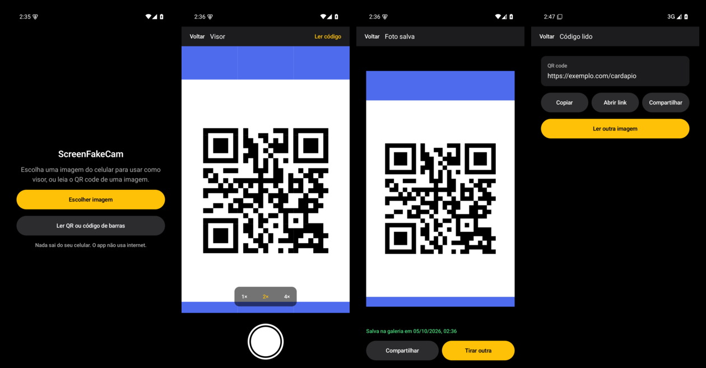

<p align="center"></p>

# ScreenFakeCam

[](https://github.com/BrunodosSantosVaz/screenfakecam/actions/workflows/bb-ci.yml)
[](https://github.com/BrunodosSantosVaz/screenfakecam/releases/latest)
[](https://github.com/BrunodosSantosVaz/screenfakecam/releases)
[](LICENSE)

[](https://github.com/BrunodosSantosVaz/big-bang)

Uma câmera para Android cujo visor é uma **imagem guardada no celular**: você enquadra a imagem (zoom e posição) e
aperta o obturador quando quiser. O app também lê **QR code e código de barras** de uma imagem, sem usar internet.



## Índice

- [Estado atual](#estado-atual)
- [Para que serve](#para-que-serve)
- [Recursos](#recursos)
- [Instalação](#instalação)
- [Como usar](#como-usar)
- [Para desenvolvedores](#para-desenvolvedores)
- [Versões e releases](#versões-e-releases)
- [Segurança e privacidade](#segurança-e-privacidade)
- [Limitações conhecidas](#limitações-conhecidas)
- [Contribuindo](#contribuindo)
- [Licença](#licença)

## Estado atual

A **v0.3.1** está em produção: leitor de QR/código de barras (v0.3.0), obturador com foto salva na galeria
(v0.2.0), rótulos de leitura ajustados e ícone próprio. A versão mais recente está nas
[Releases](https://github.com/BrunodosSantosVaz/screenfakecam/releases/latest), e o que vem a seguir está nas
[issues](https://github.com/BrunodosSantosVaz/screenfakecam/issues).

O ScreenFakeCam é o primeiro sistema feito do zero com o framework [Big Bang](https://github.com/BrunodosSantosVaz/big-bang):
da entrevista do produto à publicação, tudo passou pela esteira (testes de aceite travados, homologação e produção).

A revisão documental do épico [#71](https://github.com/BrunodosSantosVaz/screenfakecam/issues/71) usa um
[plano de validação](docs/validacao/71-documentacao-producao.md) contra o comportamento publicado, sem alterar o APK.

## Para que serve

Às vezes a imagem que você precisa entregar já está no celular (um print, um documento escaneado, um QR code
recebido por mensagem), mas o app que pede a foto só oferece a câmera. O ScreenFakeCam abre essa imagem como se
fosse o visor de uma câmera: você enquadra e "fotografa", e a foto vai para a galeria, pronta para ser escolhida em
qualquer app. Para QR code e código de barras, ele lê direto da imagem, sem precisar de outra tela para apontar.

## Recursos

- **Visor parado numa imagem do celular**, escolhida pelo seletor de fotos do Android (sem acesso amplo à galeria).
- **Zoom de 1× a 4×** (botões ou dois dedos) e **enquadramento** arrastando; o enquadramento nunca sai da imagem.
- **Teclado e D-pad:** com foco no visor (contorno âmbar), setas movem a imagem e **+ / -** mudam o zoom entre
  1×, 2× e 4×. **Tab** percorre os controles; os limites de zoom e de enquadramento continuam valendo.
- **Obturador manual**: a foto recorta o que o visor mostra, na resolução da imagem decodificada. Imagens grandes
  podem ser reduzidas ao carregar para limitar o uso de memória; o arquivo original não é alterado e nada é
  disparado sozinho.
- **Foto salva na galeria** (Pictures/ScreenFakeCam no Android 10 ou mais novo; no 8 e 9, onde você escolher), com
  **Compartilhar**, **Tirar outra** e o atalho **Última**.
- **Leitor de QR code e código de barras** (13 formatos, entre eles QR, EAN-13, Code 128 e Data Matrix), pela tela
  inicial ou pelo botão **Ler código** do visor, para códigos pequenos depois do zoom.
- **Copiar, Compartilhar e Abrir link**: só endereços `http://` e `https://` podem ser abertos, e só por toque.
- Interface em português, tema escuro, usável a partir de 360 dp de largura.

## Instalação

1. No celular Android **8.0 ou mais novo**, abra a página de
   [Releases](https://github.com/BrunodosSantosVaz/screenfakecam/releases/latest) e baixe
   `screenfakecam-vX.Y.Z-android.apk`.
2. Abra o arquivo baixado. Na primeira vez, o Android pede para permitir a instalação de apps do navegador ou do
   gerenciador de arquivos: permita só para essa instalação.
3. Para atualizar, instale a versão nova por cima: as versões publicadas são assinadas com a mesma chave.
   Uma versão anterior pode não instalar por cima da atual; regressões seguem o [procedimento de retorno](docs/operacao/voltar-versao.md).

Conferir o download (opcional): cada Release traz o `SHA256SUMS-android.txt` e o atestado de origem do APK:

```bash
sha256sum -c SHA256SUMS-android.txt
gh attestation verify screenfakecam-vX.Y.Z-android.apk --repo BrunodosSantosVaz/screenfakecam
```

## Como usar

1. **Escolher imagem** → a imagem aparece parada no visor.
2. Use **1×, 2×, 4×** ou dois dedos para o zoom e arraste para enquadrar. Atalhos do visor só atuam quando ele
   está focado; focar os botões de zoom preserva a navegação de teclado.
3. Aperte o **obturador** (o círculo branco). A tela **Foto salva** mostra a foto e oferece **Compartilhar** ou
   **Tirar outra**.
4. Para um código: **Ler QR ou código de barras** na tela inicial, ou **Ler código** no visor depois de dar zoom.

O passo a passo completo, com os detalhes de cada versão do Android, está no [guia de uso](docs/guia/usar.md).

## Para desenvolvedores

**Stack:** Kotlin 2.4 + Jetpack Compose (Material 3), minSdk 26, ZXing para os códigos; sem servidor, sem banco,
sem internet. Decisões em [`STACK.md`](STACK.md) e [`docs/decisoes/`](docs/decisoes/).

**Estrutura:**

| Pasta | O que tem |
| --- | --- |
| `app/src/main/java/.../domain` | regras puras: enquadramento, recorte, política de links |
| `app/src/main/java/.../application` | casos de uso: carregar imagem, obturador, ler código |
| `app/src/main/java/.../infrastructure` | Android: seletor, MediaStore, ZXing |
| `app/src/main/java/.../ui` | telas em Compose e ViewModels |
| `tests/aceite/` | testes de aceite de cada épico (travados: só a esteira muda) |
| `packaging/android/` | build do APK assinado |
| `docs/` | produto, negócio, arquitetura, design, guia e operação |

**Rodar a partir do código:** Android Studio, ou JDK 17+ e Android SDK (`JAVA_HOME`, `ANDROID_HOME`) na linha de
comando. Os comandos ficam em `bigbang.toml` (`[comandos]`):

```bash
./gradlew testDebugUnitTest            # testes (unitários, de tela com Robolectric e de aceite)
./gradlew lint ktlintCheck             # lint
./gradlew koverVerifyDebug             # cobertura mínima
./gradlew assembleDebug                # APK de desenvolvimento
```

A cobertura mínima é **80% nas camadas de domínio e aplicação**. Os testes de tela locais usam Robolectric;
homologar o APK exige instalar a candidata e registrar o Android e os cenários realmente executados.

O APK de produção é assinado só na esteira, com os segredos `BB_ASSINATURA_*` do repositório; não há variáveis de
ambiente de execução. Instruções para IAs em [`AGENTS.md`](AGENTS.md); pegadinhas em
[`docs/memoria.md`](docs/memoria.md); processo de trabalho em [`.bigbang/processo/`](.bigbang/processo/).

## Versões e releases

- **Produção:** cada [Release](https://github.com/BrunodosSantosVaz/screenfakecam/releases/latest) `vX.Y.Z` traz o
  APK assinado, o `SHA256SUMS-android.txt` e o atestado de origem: são os mesmos bytes que foram homologados.
- **Homologação:** as pre-releases `vX.Y.Z-rc.N` são candidatas para teste; não instale no uso do dia a dia.
- O que mudou em cada versão: [`CHANGELOG.md`](CHANGELOG.md). Versões em [SemVer](https://semver.org/lang/pt-BR/).
- Para quem mantém o projeto: [runbooks de entrega, retorno, assinatura e incidente](docs/operacao/README.md).

## Segurança e privacidade

- O app **não pede permissão de internet**. Sem conta, sem analytics, sem anúncios. **Compartilhar** envia a foto
  ou o texto ao app que você escolher; **Abrir link** entrega o endereço ao navegador, que pode usar internet.
- Lê só a imagem que você escolhe no seletor do Android; mantém a imagem decodificada e o resultado em memória,
  sem histórico persistente. A foto nova salva a seu pedido fica na galeria até você a remover.
- Retenção, backup e ações externas: [inventário de dados locais](docs/dados/inventario.md).
- Links lidos de QR só abrem com o seu toque, no seu navegador, e só `http://`/`https://`. Confira o endereço:
  um QR pode levar a um site enganoso.
- Encontrou uma falha de segurança? Siga a [política de segurança](SECURITY.md): relato privado, nunca numa issue
  pública.

## Limitações conhecidas

- **Não substitui a câmera dentro de outros apps:** apps que abrem a própria câmera ao vivo não veem o
  ScreenFakeCam, e a partir do Android 11 só câmeras pré-instaladas recebem o pedido "tirar foto" de outro app
  ([ADR-0002](docs/decisoes/ADR-0002-sem-camera-para-outros-apps.md)). Use a foto salva na galeria.
- Câmera virtual por root ou injeção está fora do escopo de propósito: serve para enganar verificações de presença.
- A resolução salva parte da imagem decodificada: não há garantia de manter todos os pixels de um arquivo grande.
- Em v0.3.1, o visor usa toque; a correção de teclado/D-pad está no [bug #70](https://github.com/BrunodosSantosVaz/screenfakecam/issues/70).
- Sem versão para iPhone; sem edição além de zoom e enquadramento; sem vídeo.
- No Android 8 e 9, salvar a foto pergunta onde guardar (o app não pede permissão de armazenamento).

## Contribuindo

Pedidos e bugs pelas [issues](https://github.com/BrunodosSantosVaz/screenfakecam/issues), nos formulários do
repositório; o passo a passo está em [CONTRIBUTING.md](CONTRIBUTING.md), e vale o
[código de conduta](CODE_OF_CONDUCT.md). O trabalho segue a esteira do Big Bang: todo bug ganha primeiro um teste que falha, toda mudança chega
por PR revisado e passa pela homologação antes da produção.

## Licença

[GPL-3.0](LICENSE). O framework Big Bang, em `.bigbang/`, é MIT (`.bigbang/LICENSE`). Componentes de terceiros:
ZXing (Apache-2.0) e as bibliotecas AndroidX/Jetpack Compose (Apache-2.0).
