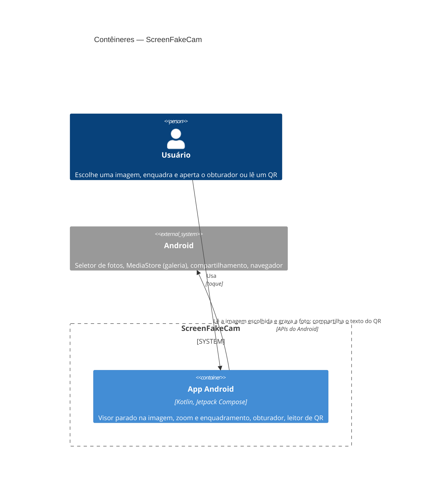

# ScreenFakeCam — Stack

> Escrito na Fundação (F2). Só muda com decisão do dono registrada em ADR. Este arquivo é zona sensível: todo PR
> que o altera tem revisão humana.

## Resumo da decisão

App Android nativo em **Kotlin com Jetpack Compose**, sem servidor e sem banco, entregue como APK pelo perfil
compilado do Big Bang. Leitura de QR e código de barras com **ZXing**, livre e offline. Alternativas descartadas
(Flutter, React Native/Expo) e motivos no ADR.

Decisão registrada em [ADR-0001](docs/decisoes/ADR-0001-stack.md).

## Linguagens, frameworks e versões

| Item | Escolha | Versão |
| --- | --- | --- |
| Linguagem | Kotlin | 2.4.20 |
| Framework | Android SDK (minSdk 26 / Android 8.0; targetSdk 36; compileSdk 37, exigido pelo Compose 1.12) | — |
| Front-end | Jetpack Compose (Material 3) | BOM 2026.09.00 |
| Build e pacotes | Gradle Wrapper (9.8.0, hash fixo) + Android Gradle Plugin, catálogo `gradle/libs.versions.toml` | AGP 9.4.1 |
| JDK de build | Temurin (local) ou o JDK do runner da CI | 17 ou mais novo |

## Banco de dados

Nenhum. O app não guarda dados: lê a imagem escolhida pelo seletor de fotos do Android e grava a foto nova na
galeria (MediaStore) só quando o usuário aperta o obturador.

## Tipo de entrega e alvo

Perfil **compilado**, sistema **`android`**: `packaging/android/build.sh` gera um único APK assinado
(`screenfakecam-vX.Y.Z-android.apk`), publicado no GitHub Releases. A chave de assinatura fica num segredo do
repositório (F4), nunca no código.

## Arquitetura

| Camada | Pasta | Pode depender de |
| --- | --- | --- |
| Domínio | `app/src/main/java/io/github/brunodossantosvaz/screenfakecam/domain/` | nada (Kotlin puro, sem Android) |
| Aplicação | `…/screenfakecam/application/` | domínio |
| Infraestrutura | `…/screenfakecam/infrastructure/` (Android, MediaStore, ZXing) | aplicação, domínio |
| Interface (UI) | `…/screenfakecam/ui/` (Compose, ViewModels) | aplicação |

## Ferramentas de qualidade

| Para quê | Ferramenta | Comando (`[comandos]` no `bigbang.toml`) |
| --- | --- | --- |
| Testes | JUnit 4 + Robolectric + Compose UI Test (testes locais, sem emulador) | `testes` |
| Testes de aceite | Os mesmos, em `tests/aceite/` (pacote `aceite`, incluído como fonte de teste do módulo `app`) | `testes_aceite` |
| Lint e formatação | Android Lint + ktlint | `lint` |
| Tipos | Compilador Kotlin (código e testes) | `tipos` |
| Arquitetura | Konsist (dependências entre camadas) | `arquitetura` |
| Cobertura | Kover | `cobertura` |

## Cobertura mínima

{{testes.cobertura_minima}}% nas camadas de domínio e aplicação.

## Configuração da esteira

<!-- bb:config:inicio -->
<!-- Gerado pelo Big Bang v1.3.0 a partir de bigbang.toml. Não edite: personalize em bigbang.toml. -->

**Perfil de entrega:** `compilado`

**Caminhos do artefato** (mudança aqui exige release):

- `app/src/main/`
- `app/build.gradle.kts`
- `app/proguard-rules.pro`
- `build.gradle.kts`
- `settings.gradle.kts`
- `gradle.properties`
- `gradle/`
- `gradlew`
- `version.properties`
- `packaging/`

**Zonas sensíveis** (revisão humana):

- `app/src/main/AndroidManifest.xml`
- `app/proguard-rules.pro`
- `packaging/**`
- Sempre: `.github/**`, `tests/aceite/**`, `STACK.md`, `DESIGN.md`, `PRODUTO.md`, `bigbang.toml`, `flags.toml` e os arquivos de dependência da stack.

<!-- bb:config:fim -->

## Dependências de execução permitidas

Toda dependência **direta de execução** precisa estar nesta tabela (a *Guarda da stack* lê esta tabela).
Dependências de desenvolvimento são livres. Linha nova só com ADR e pelo portão de tecnologia (`bb-nova-tecnologia`).

<!-- bb:dependencias:inicio -->
| Pacote | Ecossistema | Faixa de versão | Para quê | ADR |
| --- | --- | --- | --- | --- |
| androidx.core:core-ktx | maven | 1.x | Base do AndroidX | ADR-0001 |
| androidx.activity:activity-compose | maven | 1.x | Activity com Compose e seletor de fotos | ADR-0001 |
| androidx.lifecycle:lifecycle-viewmodel-compose | maven | 2.x | ViewModel nas telas | ADR-0001 |
| androidx.compose:compose-bom | maven | 2026.x | Versões alinhadas do Compose | ADR-0001 |
| androidx.compose.ui:ui | maven | BOM | Compose UI | ADR-0001 |
| androidx.compose.material3:material3 | maven | BOM | Componentes Material 3 | ADR-0001 |
| androidx.exifinterface:exifinterface | maven | 1.x | Orientação correta da imagem (EXIF) | ADR-0001 |
| com.google.zxing:core | maven | 3.5.x | Ler QR e código de barras da imagem, offline | ADR-0001 |
<!-- bb:dependencias:fim -->

## Histórico de mudanças

| Data | O que mudou | ADR |
| --- | --- | --- |
| 2026-10-04 | Versão inicial (Fundação F2) | ADR-0001 |
| 2026-10-04 | compileSdk 37 (exigido pelas bibliotecas do Compose 1.12); JDK 17+; Gradle 9.8.0 (F5) | ADR-0001 |
