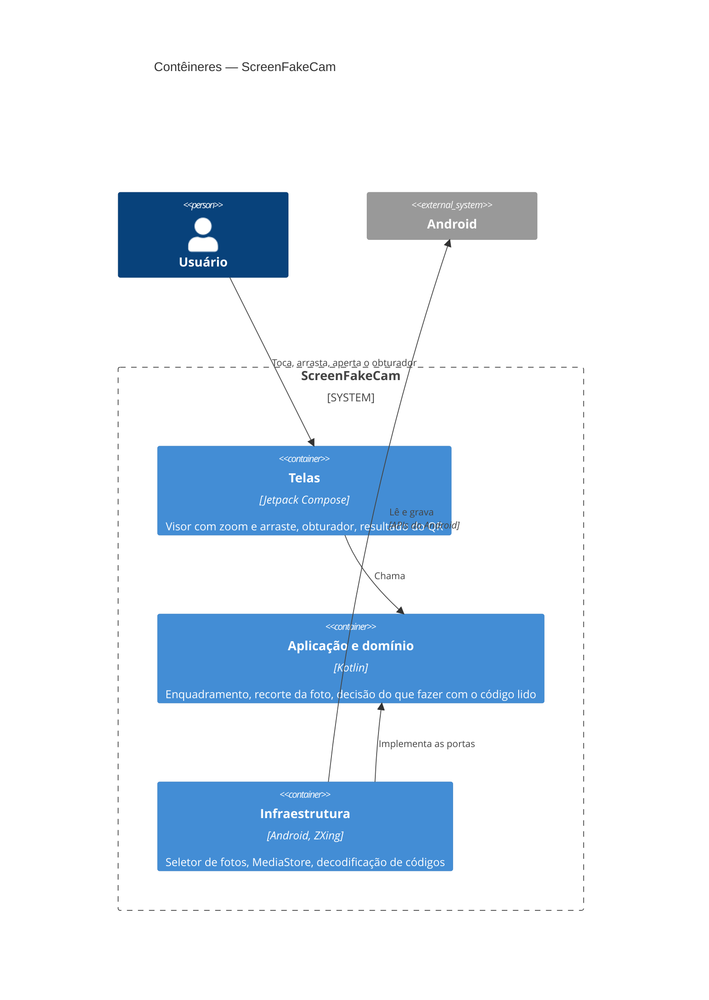

# ScreenFakeCam — Contêineres (C4, nível 2)

Um único APK, um módulo Gradle (`app`). As camadas são pacotes; Konsist confere que `domain` não depende de nada e
que `ui` não chama `infrastructure` direto.
