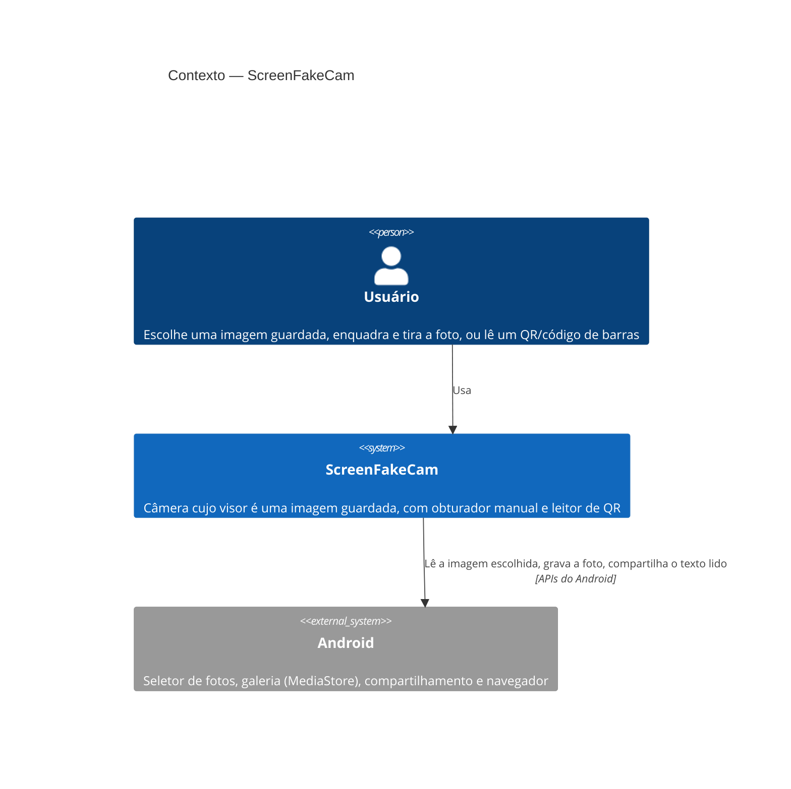

# ScreenFakeCam — Contexto (C4, nível 1)

| Elemento | Responsabilidade |
| --- | --- |
| Usuário | Qualquer pessoa com Android 8.0+, sem cadastro |
| Android | Entrega só a imagem que o usuário escolheu; recebe a foto na galeria; abre links no navegador do usuário |

Sem servidor e sem internet: nada sai do aparelho.
