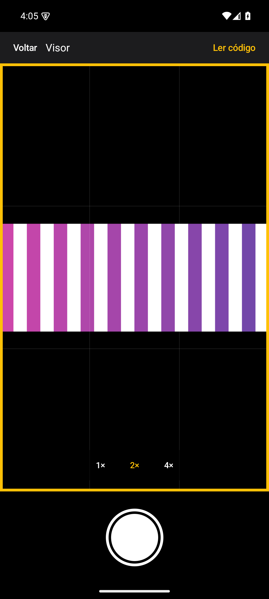

# Produção e homologação — ScreenFakeCam v0.3.2

A [v0.3.2 está publicada](https://github.com/BrunodosSantosVaz/screenfakecam/releases/tag/v0.3.2), com os mesmos
bytes da candidata assinada v0.3.2-rc.1. Esta entrega agrupou os bugs [#70](https://github.com/BrunodosSantosVaz/screenfakecam/issues/70)
(teclado/foco), [#72](https://github.com/BrunodosSantosVaz/screenfakecam/issues/72) (SBOM Android) e
[#81](https://github.com/BrunodosSantosVaz/screenfakecam/issues/81) (teto de decodificação), todos fechados na
milestone v0.3.2. O épico documental #84 registra a entrega; não constrói outro APK.

## Fonte e etapas da esteira

| Etapa | Recibo oficial |
| --- | --- |
| Regressão/correção/revisão dos bugs | [PR #77](https://github.com/BrunodosSantosVaz/screenfakecam/pull/77), [PR #78](https://github.com/BrunodosSantosVaz/screenfakecam/pull/78), [PR #82](https://github.com/BrunodosSantosVaz/screenfakecam/pull/82); testes anteriores às correções, aceites congelados preservados |
| Fonte efetivamente compilada | [04ccad4caed538c37b3af21a6594a7158032d905](https://github.com/BrunodosSantosVaz/screenfakecam/commit/04ccad4caed538c37b3af21a6594a7158032d905) |
| CI completa da fonte | [Run 37584902704](https://github.com/BrunodosSantosVaz/screenfakecam/actions/runs/37584902704), verde no SHA acima |
| Candidata assinada | [Run 37584314353](https://github.com/BrunodosSantosVaz/screenfakecam/actions/runs/37584314353), [v0.3.2-rc.1](https://github.com/BrunodosSantosVaz/screenfakecam/releases/tag/v0.3.2-rc.1) |
| Revisão independente da release | [PR #83](https://github.com/BrunodosSantosVaz/screenfakecam/pull/83), com CI/checks da fonte exata |
| Homologação e decisão delegada | [Recibo #70](https://github.com/BrunodosSantosVaz/screenfakecam/issues/70#issuecomment-6033050720), [#72](https://github.com/BrunodosSantosVaz/screenfakecam/issues/72#issuecomment-6033051009), [#81](https://github.com/BrunodosSantosVaz/screenfakecam/issues/81#issuecomment-6033051279); autorização prévia do dono, ensaio executado pelo agente |
| Publicação com portão e ambiente de produção | [Run 37587716471](https://github.com/BrunodosSantosVaz/screenfakecam/actions/runs/37587716471), concluído com sucesso; promoção sem recompilar |
| Tag e main de publicação | [93ad178c226e2bb4ff4de2c9354b9f94419853b1](https://github.com/BrunodosSantosVaz/screenfakecam/commit/93ad178c226e2bb4ff4de2c9354b9f94419853b1), tag v0.3.2 |
| Devolução à develop | [d87e0bca34f41c0d10f83a4e60d5e54f2779d4f4](https://github.com/BrunodosSantosVaz/screenfakecam/commit/d87e0bca34f41c0d10f83a4e60d5e54f2779d4f4); [CI 37588274323](https://github.com/BrunodosSantosVaz/screenfakecam/actions/runs/37588274323), verde |

O workflow de publicação foi disparado com a camada de esteira `321c24aeeb4def5c5eb94bec2e3993bf2ed27e5c`.
Esse é o SHA de execução do workflow, não a fonte compilada do APK. A candidata veio de `04ccad4...`, e a
publicação mesclou sua release em `93ad178...`; os digests abaixo conferem os bytes promovidos.

## Artefatos e igualdade

| Item | Valor conferido |
| --- | --- |
| APK publicado | [screenfakecam-v0.3.2-android.apk](https://github.com/BrunodosSantosVaz/screenfakecam/releases/download/v0.3.2/screenfakecam-v0.3.2-android.apk), 1.235.989 bytes |
| SHA256 do APK, igual à rc.1 | `29d89a99d2839185138259dafc688ee85fbcb087a6a788a8ebc8612dd3a43fca` |
| Versão Android | versionName 0.3.2, versionCode 302; minSdk 26, targetSdk 36 |
| Certificado público RSA4096, igual à versão anterior | SHA256 `4edaf7eae89d5da175d0817739b5866f9e7180acdcb3f260bb84b7143742e20d` |
| Checksums da produção | [SHA256SUMS-android.txt](https://github.com/BrunodosSantosVaz/screenfakecam/releases/download/v0.3.2/SHA256SUMS-android.txt), validado sobre o APK correspondente |
| SBOM publicado, igual à rc.1 | [sbom-cyclonedx.json](https://github.com/BrunodosSantosVaz/screenfakecam/releases/download/v0.3.2/sbom-cyclonedx.json), SHA256 `62100900817910c2f69080922f1eab47c7a680c25ce4063a0b37c0bc7bddaa32` |

Downloads separados da candidata e da produção foram comparados byte a byte: APK e SBOM são idênticos.
O arquivo SHA256SUMS muda o nome do APK ao promover de rc.1 para estável, mantendo seu digest. A assinatura e
`gh attestation verify` foram conferidos sobre o APK exato, conforme os recibos de homologação. O atestado
é o da construção da candidata oficial; o arquivo foi promovido sem uma nova compilação.

O SBOM tem 303 componentes, sendo 101 Maven. Todos os 100 módulos do lock de release estão presentes,
incluindo ZXing core 3.5.4, AndroidX core/core-ktx 1.19.1, Kotlin stdlib 2.4.20 e Compose ui-android 1.12.1.
O catálogo usa o lock realmente resolvido pelo Gradle; presença dos módulos não promete licenças nem arestas
completas de dependência quando o catálogo de lock não oferece esses dados.

## Ensaio Android real dos bytes publicados

Executado pelo agente com autorização prévia do dono, em `emulator-5554`, Android 15/API 35, tela 1080×2400.
Não foi teste manual do dono nem aparelho físico. O APK da candidata foi instalado sobre a produção oficial
v0.3.1 sem limpar dados, confirmando a compatibilidade da assinatura e a instalação do versionCode 302.
A igualdade dos arquivos comprova que estes são os bytes agora publicados; não se atribui uma segunda sessão
de uso à cópia da Release estável apenas porque ela foi baixada.

| Cenário exercitado | Resultado observado |
| --- | --- |
| Imagem sintética grande, 10001×2001 | Picker concedeu acesso à imagem; carregamento e renderização concluíram |
| Foco e zoom por teclado | Tab chegou ao visor com borda âmbar; `+` mudou 1× para 2× |
| D-pad e isolamento de foco | DPAD_RIGHT mudou o enquadramento; com botão de zoom focado, `+` preservou a imagem e não vazou ao visor |
| Obturador explícito | Um acionamento pelo agente acrescentou exatamente uma foto; abrir/mover o visor não disparou outra |
| Foto e arquivo original | JPEG 1250×501, recorte da imagem decodificada, sem EXIF; original permaneceu com SHA256 `210d584519c36d7a7f230436c8843fb5a3acb49950b599b75899ef5fb7f16912` |
| Navegação | Voltar levou à tela inicial |
| QR de imagem sintética | Exibiu `ScreenFakeCam homologacao 0.3.2` e ações Copiar/Compartilhar/Ler outra imagem; não acionou envio ou compartilhamento |

A screenshot acima é do ensaio, com imagem sintética. O teto de decodificação está comprovado pelo carregador
e pelas regressões de #81 para limites numéricos, dimensões ímpares, teto exato e EXIF; não é inferido da imagem
visual. O lado maior decodificado fica até duas vezes o maior lado da tela, podendo ficar abaixo do teto pela
amostragem em potência de dois. A foto usa o bitmap decodificado/enquadrado e não promete preservar os pixels
originais de uma imagem grande.

## Limites e não aplicabilidade

- Este recibo comprova Android 15 emulado; não valida aparelhos físicos, Android 8/9 nem TalkBack integral.
- O QR do ensaio contém texto, não URL; abertura de link e transmissão por Compartilhar não foram exercitadas.
  RN-0006/0007 continuam cobertas pelos aceites congelados. O app segue sem permissão de internet.
- Backend, banco, login, migrações e saúde HTTP não se aplicam ao APK offline, conforme o checklist existente.
- Recuperação de keystore, rotação de chave, incidente e downgrade real não foram exercitados por esta entrega.
  Seus runbooks continuam orientações; custódia/backup privado da chave não é presumido a partir da assinatura pública.
- O fechamento documental de #84 usa Publicar sem release, com revisão e CI próprias; não altera esta tag ou APK.
